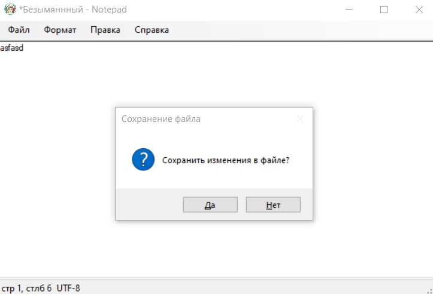

# Notepad

## Составляющие интерфейса:
  1. Меню.
  2. Поле состояния.
  3. Текстовое поле для редактирования.
  4. Окно изменения шрифта.
  5. Окно справки.

## Технические возможности:
  1. Работа с файлами: создание, сохранение, открытие.
  2. Реализация работы с тектом: копирование, вставка, вырезка.
  3. Изменения шрифта: размер, стиль, цвет
  4. Возможность напечатать файл
  5. Поддержка горячих клавиш
  
## Баги:
  1. Копирование текста с измененным шрифтом приводит к сбросу шрифта текста (шрифт становится по умолчанию).
  
## Скриншоты:
  
  
  
  
  
  
  
  
  
  
  
  
  
  
  
